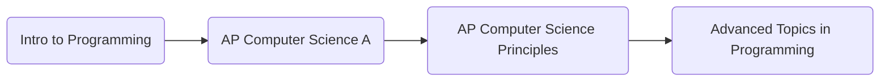

# Background
I was introduced to sorting algorithms and Big-O notation in a course offered at my high school. These are programs I wrote answering the prompt given. 

These are the courses I took:  

---
## What I Learned
I learned about the most popular sorting algorithms
* Bubble Sort
* Selection Sort
* Insertion Sort
* ...
I also created my own sorting algorithm, where we adopted the idea of selection sort and sorted according to the maximum value instead of the minimum value.

